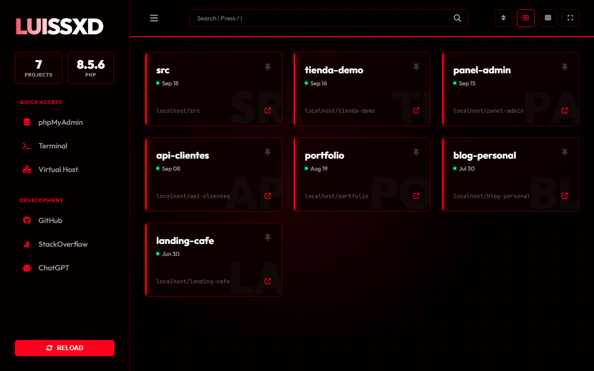
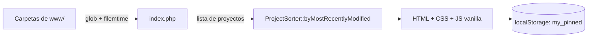

<div align="center">
  
  <h1>LocalHub</h1>
  <p><b>Panel de inicio para Laragon: lista tus proyectos locales por actividad reciente en una sola página PHP.</b></p>
  
  
  
  
  
  <p>
    <a href="#-inicio-rápido">Inicio rápido</a> ·
    <a href="#-características">Características</a> ·
    <a href="#-arquitectura">Arquitectura</a> ·
    <a href="#-pruebas">Pruebas</a> ·
    <a href="#-lo-que-todavía-no-existe">Limitaciones</a>
  </p>
</div>

LocalHub reemplaza la página de bienvenida de Laragon por un panel con tema "Cyberpunk Red". Escanea las carpetas junto a `index.php` (normalmente `C:\laragon\www`), las muestra como tarjetas ordenadas por última modificación y ofrece búsqueda, pines y accesos rápidos. **No** es un gestor de servidores: no inicia ni detiene servicios ni crea virtual hosts.

## 🎬 Vista rápida

<div align="center">
  
</div>

> Captura real con carpetas de ejemplo creadas para la demo. La tarjeta `src` aparece porque, en esa prueba, `src/` estaba junto a `index.php` y el panel lista todo directorio no ignorado.

## ✨ Características

| Característica | Detalle |
|---|---|
| Listado automático | Escanea con `glob('*')` los directorios hermanos de `index.php`; ignora `.git`, `.idea`, `vscode`, `node_modules` y `vendor`. |
| Orden por actividad | Del más recientemente modificado (`filemtime`) al más antiguo, vía `ProjectSorter`. Omite entradas cuya fecha no se puede leer. |
| Búsqueda instantánea | Filtro en el cliente; el atajo `/` enfoca el campo. |
| Pines | Fijas proyectos y aparecen primero; se guardan en `localStorage` (por navegador, sin sincronización). |
| Orden alfabético | Botón para alternar actividad / alfabético. |
| Vistas | Grilla normal y compacta, sidebar colapsable, pantalla completa y recarga manual. |
| Datos en barra lateral | Contador de proyectos y versión de PHP en ejecución. |
| Accesos rápidos | Enlace a `/phpmyadmin`, más GitHub, Stack Overflow y ChatGPT (pestaña nueva). |
| Salida escapada | Los nombres de carpeta se escapan con `htmlspecialchars` para evitar XSS. |

## 🏗️ Arquitectura



Todo vive en `index.php` (lógica, plantilla, CSS y JS). Solo el ordenamiento se extrajo a `src/ProjectSorter.php` para poder probarlo.

## 🚀 Inicio rápido

| Requisito | Versión |
|---|---|
| PHP | 8.0 o superior (probado con 8.5) |
| Composer | Opcional, solo para las pruebas |
| Internet | Fuentes y Font Awesome se cargan por CDN |

1. Clona el repositorio.
   ```bash
   git clone https://github.com/Luiss2080/LocalHub.git
   cd LocalHub
   ```
2. Pruébalo sin Laragon con el servidor embebido de PHP.
   ```bash
   php -S localhost:8000
   ```
3. Para usarlo como panel real, copia `index.php` y la carpeta `src/` a la raíz de tu `www` de Laragon y abre `http://localhost`.

Cada tarjeta abre `/<nombre-del-proyecto>` en el mismo host.

<details>
<summary>Estructura de carpetas</summary>

```text
index.php                 # Panel completo (PHP + HTML + CSS + JS)
src/ProjectSorter.php     # Ordenamiento puro, testeable
tests/ProjectSorterTest.php
.github/workflows/ci.yml  # php -l + PHPUnit en PHP 8.1, 8.2 y 8.3
composer.json  phpunit.xml
```

</details>

## 🧪 Pruebas

```bash
composer install
vendor/bin/phpunit
```

`tests/ProjectSorterTest.php` define 6 tests sobre `ProjectSorter`: orden descendente, lista vacía, un solo proyecto, timestamps iguales, entrada sin mutar y timestamps cero/negativos. La interfaz (`index.php`) no tiene pruebas. En este trabajo no se ejecutó PHPUnit localmente (no había Composer); la cifra sale de leer el archivo de tests. El CI corre `php -l` sobre todos los `.php` y PHPUnit.

## 🔒 Seguridad

- Nombres de proyecto escapados al imprimirlos y URL con `rawurlencode`.
- No hay autenticación: está pensado solo para uso local; no lo expongas a Internet.

## 🚧 Lo que todavía no existe

- "Terminal" y "Virtual Host" son marcadores (`href="#"`) sin función.
- Los pines no se sincronizan entre dispositivos.
- No excluye su propia carpeta `src/` ni carpetas como `docs/` si están junto a `index.php`.
- Interfaz y menús en inglés, con marca "LUISSXD" fija en el código.
- Requiere CDN externos para tipografías e iconos.

## 📄 Licencia

Sin licencia definida: todos los derechos reservados por defecto.

<div align="center"><sub>Hecho por Luiss2080 · panel local para Laragon</sub></div>
